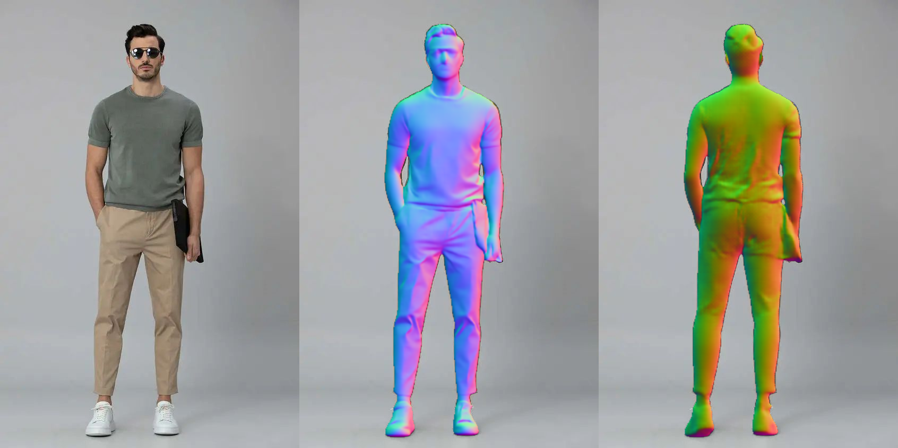
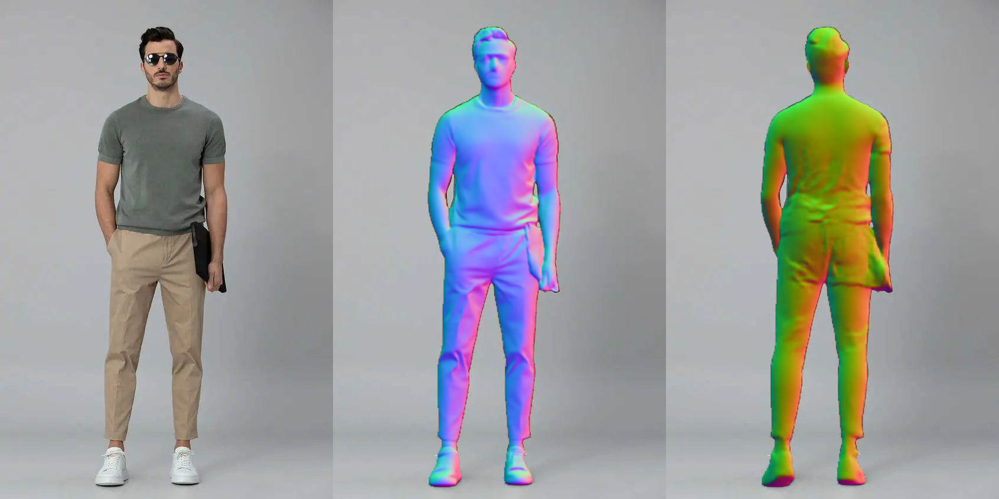

## Technical tricks to improve or accelerate ECON

### If the reconstructed geometry is not satisfying, play with the adjustable parameters in _config/econ.yaml_

- `use_smpl: ["hand"]`
  - [ ]: don't use either hands or face parts from SMPL-X
  - ["hand"]: only use the **visible** hands from SMPL-X
  - ["hand", "face"]: use both **visible** hands and face from SMPL-X
- `thickness: 2cm`
  - could be increased accordingly in case final reconstruction **xx_full.obj** looks flat
- `k: 4`
  - could be reduced accordingly in case the surface of **xx_full.obj** has discontinous artifacts
- `hps_type: PIXIE`
  - "pixie": more accurate for face and hands
  - "pymafx": more robust for challenging poses
- `texture_src: image`
  - "image": direct mapping the aligned pixels to final mesh
  - "SD": use Stable Diffusion to generate full texture (TODO)

### To accelerate the inference, you could

- `use_ifnet: False`
  - True: use IF-Nets+ for mesh completion ( $\text{ECON}_\text{IF}$ - Better quality, **~2min / img**)
  - False: use SMPL-X for mesh completion ( $\text{ECON}_\text{EX}$ - Faster speed, **~1.8min / img**)

```bash
# For single-person image-based reconstruction (w/o all visualization steps, 1.5min)
python -m apps.infer -cfg ./configs/econ.yaml -in_dir ./examples -out_dir ./results -novis
```

### Bending legs

Related Issues (ICON/ECON/TeCH):
- https://github.com/YuliangXiu/ECON/issues/133
- https://github.com/YuliangXiu/ECON/issues/5
- https://github.com/YuliangXiu/ICON/issues/68
- https://github.com/huangyangyi/TeCH/issues/14

Reasons:

- Most existing human pose estimators (HPS) have some bias towards a mean pose, which has the legs bent
- The pseudo GT of HPS is obtained by fitting SMPL(-X) onto 2D landmarks, 2D landmarks has depth ambiguity, which make legs bent

Solution:

- The issue of "bending legs" could be significantly reduced by refining the pose of the SMPL(-X) body using an accurate **front clothed normal map** directly estimated from the input image. For this, we use [Sapiens](https://github.com/facebookresearch/sapiens).
- The **back clothed normal map** is conditioned on the back body normal map, which is rendered from the SMPL(-X) body model. Therefore, the accuracy of the back clothed normal map benefits from the refined SMPL(-X) body model.

Potential risk:

- When it comes to extremely challenging poses, ECON's normal estimator might outperform Sapiens. This is mainly because ECON's normal estimation is conditioned on the SMPL(-X) body model, focusing on regressing the normal disparity between the body and clothing. This significantly reduces the need to accurately infer body articulation. In contrast, Sapiens directly estimates the normal maps from the input image without conditioning on SMPL(-X) body estimations. Therefore, if a pose is particularly challenging or rarely seen in the training set, the normal map estimated by Sapinns is likely to be problematic.


|                 Final Reconstruction                  |
| :---------------------------------------------------: |
|             w/ sapiens-normal refinement              |
|  |
|            Original ECON normal estimator             |
|        |


|                    Normal Estimation                    |
| :-----------------------------------------------------: |
|              w/ sapiens-normal refinement               |
|  |
|             Original ECON normal estimator              |
|        |


If you use Sapiens in your research, please consider citing it.
```bibtex
@misc{khirodkar2024_sapiens,
    title={Sapiens: Foundation for Human Vision Models},
    author={Khirodkar, Rawal and Bagautdinov, Timur and Martinez, Julieta and Zhaoen, Su and James, Austin and Selednik, Peter and Anderson, Stuart and Saito, Shunsuke},
    year={2024},
    eprint={2408.12569},
    archivePrefix={arXiv},
    primaryClass={cs.CV},
    url={https://arxiv.org/abs/2408.12569}
}
```


